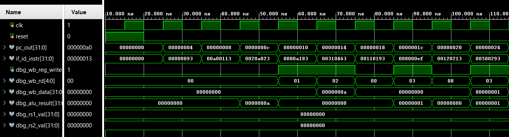

# 5-Stage Pipelined RISC-V CPU (RV32I) — Verilog

## Overview

This project implements a **5-stage pipelined RISC-V CPU** based on the **RV32I** instruction set architecture using **Verilog HDL**.  
The design follows the classic pipeline structure:

1. Instruction Fetch (IF)  
2. Instruction Decode / Register Fetch (ID)  
3. Execute (EX)  
4. Memory Access (MEM)  
5. Write Back (WB)

The CPU has been functionally verified through waveform simulation in **Xilinx Vivado**.

---

## Pipeline Architecture

### Instruction Fetch (IF)
- Program Counter (PC) with sequential `PC + 4` logic
- Instruction memory
- IF/ID pipeline register

### Instruction Decode (ID)
- Instruction field extraction
- Register file (2 read ports, 1 write port)
- Immediate generation
- Control unit
- ID/EX pipeline register

### Execute (EX)
- ALU operand selection
- ALU control logic
- Arithmetic and logical operations
- EX/MEM pipeline register

### Memory (MEM)
- Structural MEM stage (pass-through for Level-2)
- EX/MEM pipeline register holds results and control signals

### Write Back (WB)
- ALU result forwarded to register file
- Register write-back controlled through pipelined control signals
- MEM/WB pipeline register

---

## Supported Instructions (Level-2)

- R-type arithmetic instructions (e.g., `add`, `sub`)
- I-type arithmetic instructions (e.g., `addi`)
- Sequential instruction execution (`PC + 4`)

---

## What Is Implemented

- Fully pipelined datapath with all five stages
- Correct control signal propagation across pipeline registers
- Functional ALU execution
- Correct register write-back with pipeline latency
- Modular Verilog design
- Verified through waveform simulation

---

## What Is Not Implemented (By Design)

The following features are intentionally excluded to keep the project focused on core pipelined execution:

- Hazard detection
- Data forwarding
- Load/store memory operations (`lw`, `sw`)
- Branch flushing
- Jump handling
- Data memory

These features are suitable extensions for a future enhancement (Level-3).

---

## Verification

The CPU was verified using a dedicated testbench in **Vivado**.  
Temporary debug outputs were exposed from the top module to observe internal pipeline behavior.

Verified signals include:
- Program counter progression
- Instruction flow through pipeline stages
- ALU results
- Write-back enable (`reg_write`)
- Destination register (`rd`)
- Write-back data

Correct pipeline timing and register updates were observed after pipeline fill.

# Simulation Results

The waveform below shows correct execution of the 5-stage pipeline,
including instruction fetch, ALU execution, and register write-back.

---

## Project Structure

├── cpu_top.v
├── pc.v
├── instr_mem.v
├── regfile.v
├── imm_gen.v
├── control.v
├── alu_control.v
├── alu.v
├── if_id_reg.v
├── id_ex_reg.v
├── ex_mem_reg.v
├── mem_wb_reg.v
├── tb_cpu.v
└── README.md

---

## Tools Used

- Verilog HDL
- Xilinx Vivado (simulation and waveform analysis)

---

## Notes

This project focuses on **correct pipelined execution and control flow**, not on performance optimizations or full ISA coverage.  
It is intended as an educational and architectural implementation rather than a production-ready processor.

---

## Possible Extensions

- Data forwarding unit
- Hazard detection and pipeline stalls
- Load/store support with data memory
- Branch and jump handling
- Full RV32I compliance

---

## Author

Tejasswat Rajindu
